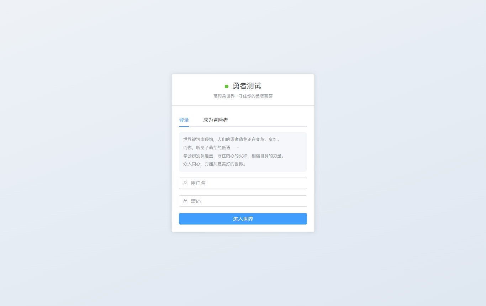
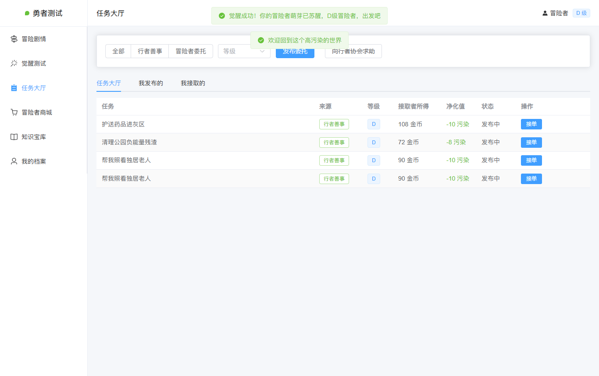
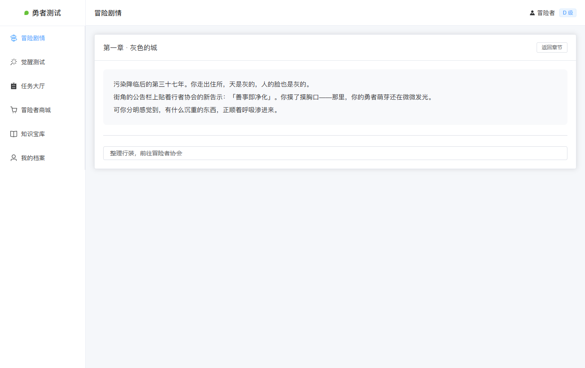
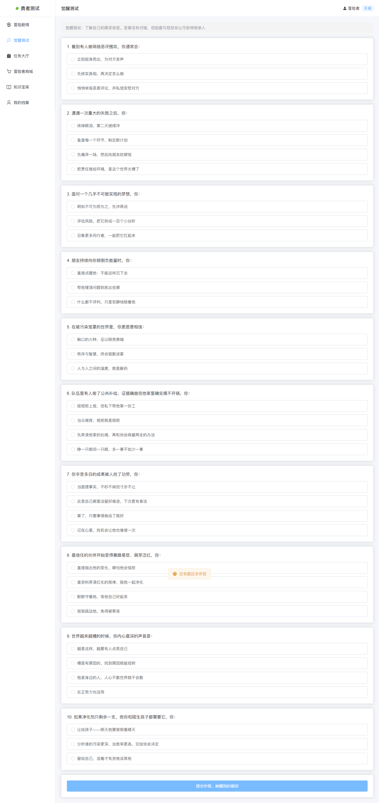
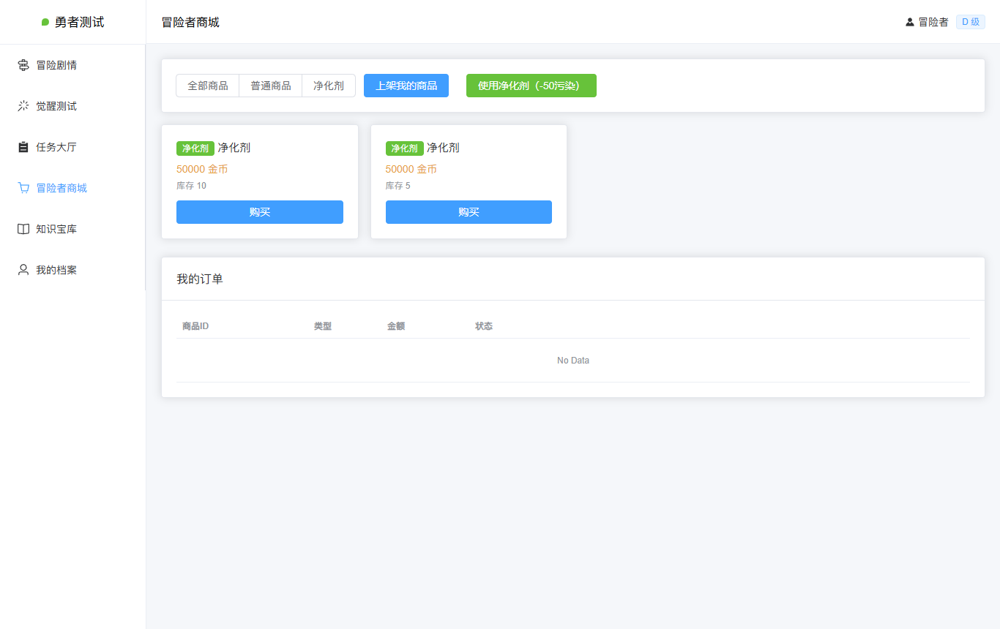
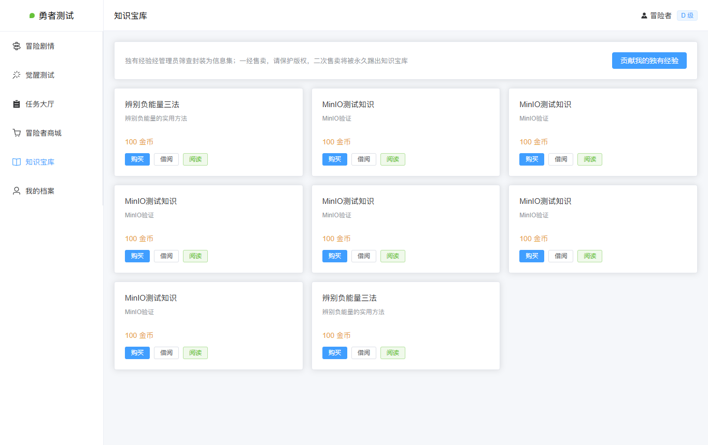
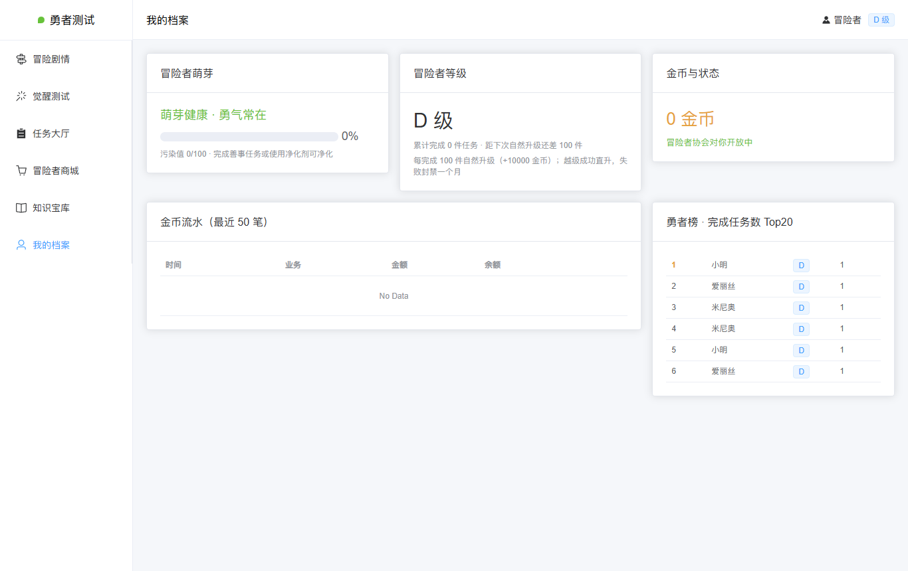

# 勇者测试（Brave Test）

[](https://github.com/mqq0000/brave-test/actions/workflows/ci.yml)

高污染世界下的**文字冒险 + 性格测试**网页游戏。玩家的"萌芽"会被环境污染侵蚀——**灰化（抑郁）/ 赤化（愤怒）**，你需要通过冒险、抉择与觉醒测试辨别负能量、净化萌芽，共建美好世界。

> 完整系统设计（23 张表 + API + 规则形式化）见 [`勇者测试-系统设计文档.md`](./勇者测试-系统设计文档.md)

## 核心玩法

- **三协会体系**
  - 🧝 **行者协会**：总管理员发布善事任务，冒险者申请协助 → 审批后生效
  - ⚔️ **冒险者协会**：发布委托收 10% 佣金，接单得 90%；S/A/B/C/D 五级段位（初始 D 级，80~120 金币的活儿干起）——100 件自然升级 +1 万奖励，越级成功直升、失败封禁 1 个月
  - 📚 **知识宝库**：投稿 → 封装定价 → 日/周/月卡借阅或购买；禁止二次售卖，违规踢出；营利 40% 归知识协会
- **剧情引擎**：章节 → 节点 → 选项三层结构，选择实时结算污染度与金币
- **觉醒测试**：勇气 / 理性 / 仁善三维计分 → 专属称号
- **经济系统**：净化剂月限 100 支 × 5 万金币；佣金 60% 月初上缴总管理员（幂等月度结算 Job）；Redis 分布式锁 + 乐观扣款防超抢

## 技术栈

| 层 | 技术 |
|---|---|
| 后端 | Java 17 · SpringBoot 3.3 · MyBatis-Plus 3.5 · MySQL 8 · Redis · JWT (jjwt 0.12) · MinIO · Knife4j 4.5 |
| 前端 | Vue 3 · Vite · Element Plus · Pinia · Vue Router · Axios · ECharts |
| 测试 | JUnit 5 单元测试（13 用例）· API 冒烟回归（38 用例）· Playwright 浏览器 E2E（12 用例） |
| 部署 | Docker 多阶段构建 · docker-compose 五服务编排 · GitHub Actions CI |

## 一键启动（docker compose）

```bash
git clone https://github.com/mqq0000/brave-test.git
cd brave-test
docker compose up -d
```

首次启动自动建库建表并注入种子数据（3 章剧情 / 10 道觉醒题 / 新手任务 / 管理员账号）。

| 服务 | 地址 |
|---|---|
| 前端 | http://localhost |
| 接口文档（Knife4j） | http://localhost:8080/doc.html |
| MinIO 控制台 | http://localhost:9001 |

**内置账号**：`superadmin / admin123`（超级管理员）；普通用户在登录页注册即成为 D 级冒险者。

> ⚠️ compose 内密码（root123 / minioadmin123）与 JWT 密钥均为演示默认值，生产环境请务必替换。

## 界面预览

| 登录 / 觉醒 | 任务大厅 |
|---|---|
|  |  |

| 冒险剧情 | 觉醒测试 |
|---|---|
|  |  |

| 冒险者商城 | 知识宝库 |
|---|---|
|  |  |

<details>
<summary>更多截图</summary>



</details>

## 本地开发

```bash
# 后端（需本地 MySQL8 + Redis + MinIO，执行 schema.sql 初始化）
cd brave-test-backend && mvn spring-boot:run

# 前端（Vite 开发服务器，代理 8080）
cd brave-test-frontend && npm i && npm run dev
```

### 回归测试

```bash
# 后端 API 冒烟（38 用例，E2E_BASE 可指定目标环境）
cd brave-test-backend && python tools/verify_e2e.py

# 浏览器 E2E（12 用例，playwright-core + 本机 Chrome）
cd brave-test-frontend && node tools/e2e_web.cjs
```

## 项目结构

```
├── brave-test-backend/        # SpringBoot 后端（entity/mapper/service/controller/test/tools）
│   └── src/main/resources/sql/schema.sql   # 建库 + 23 表 + 种子数据
├── brave-test-frontend/       # Vue3 前端（8 页面：登录/大厅/商店/宝库/剧情/测试/个人中心/管理）
├── docker-compose.yml         # MySQL + Redis + MinIO + backend + nginx 一键编排
├── .github/workflows/ci.yml   # CI：后端测试打包 + 前端构建
└── 勇者测试-系统设计文档.md     # 23 表设计 + API + 规则形式化
```

## License

仅供学习交流使用。
